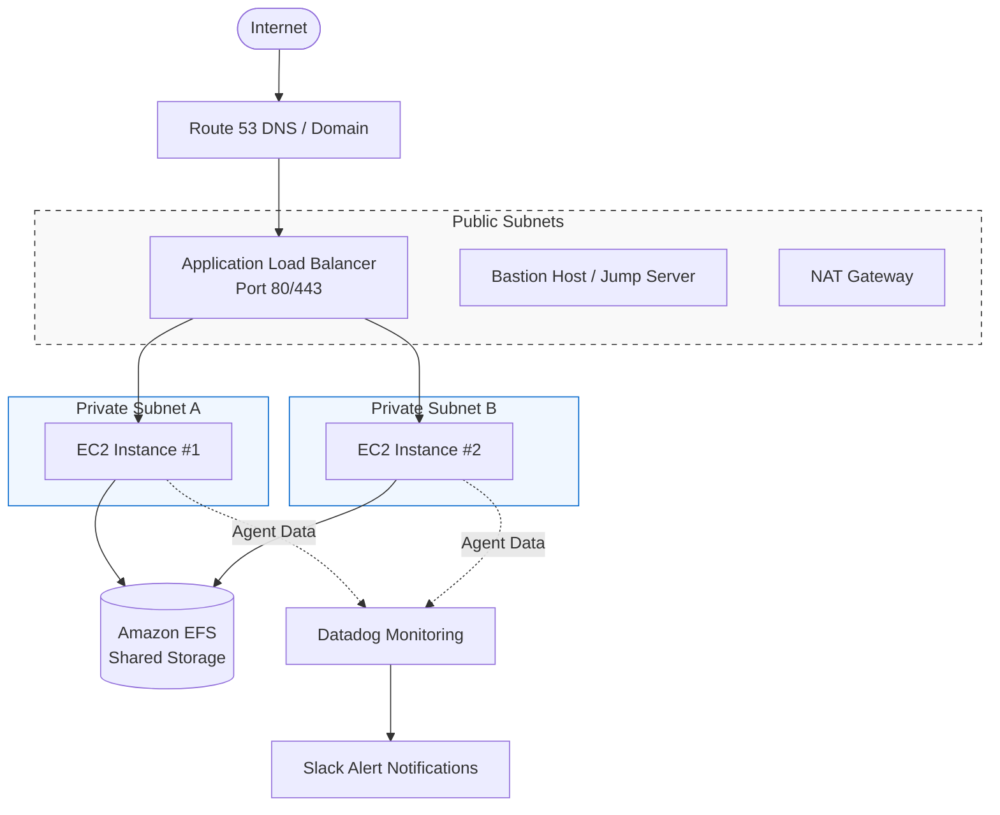

# aws-high-availability-web-application-deployment

## Project Overview
This project demonstrates the deployment of a highly available, scalable, and monitored web application on AWS.

The architecture was designed using multiple Availability Zones and AWS managed services to improve application availability, scalability, security, monitoring, and operational reliability.

The project includes:

* **Custom Amazon VPC**
* *Public and private subnets across multiple Availability Zones*
* *Internet Gateway*
* *NAT Gateway*
* *Security Groups*
* *Route Table*
 

* **Storage & Compute Infrastructure**
* *Amazon EFS (with EFS Access Point)*
* *Jump Server*
* *Amazon EC2 managed via Launch Template & Auto Scaling Group*
 

* **Traffic Management & Routing**
* *Application Load Balancer with Target Group*
* *Amazon Route 53 (integrated with Namecheap DNS)*

 
* **Security & Encryption**
* *AWS Certificate Manager (ACM) for HTTPS/SSL termination*

* **Monitoring & Alerting**
* *Datadog monitoring*
* *Slack alert notifications*

## Architecture

The application follows a highly available architecture where the Application Load Balancer distributes incoming traffic across EC2 instances running in private subnets.

The EC2 instances are managed by an Auto Scaling Group and share persistent storage through Amazon EFS.

Datadog monitors the infrastructure and sends alerts to Slack when defined thresholds are exceeded.

## Architecture Flow
 

## AWS Services Used
 

| Service | Purpose |
| :--- | :--- |
| **Amazon VPC** | Isolated network environment |
| **Amazon EC2** | Application and Bastion / Jumper Server instances |
| **Amazon EFS** | Shared persistent storage |
| **Auto Scaling** | Automatically manages EC2 capacity |
| **Application Load Balancer** | Distributes application traffic |
| **Target Group** | Manages application targets |
| **Route 53** | DNS management |
| **AWS Certificate Manager** | SSL/TLS certificate management |
| **Internet Gateway** | Internet connectivity for public resources |
| **NAT Gateway** | Outbound internet access from private subnets |
| **Security Groups** | Network-level access control |
| **IAM** | Access control for AWS resources |
| **Datadog** | Infrastructure monitoring |
| **Slack** | Monitoring notifications |
| **Namecheap** | Domain registration/DNS delegation |

 

## Deployment Documentation 

* [High Availability Network](docs/01-high-availability-network.md)
* [Amazon EFS](02-efs.md)
* [Datadog Setup](03-datadog.md)
* [Bastion Host](04-jumperserver.md)
* [Slack Integration](05-slack-integration.md)
* [Datadog Monitoring & Alerting](datadog-monitoring.md)
* [Web Application Deployment](07-web-application.md)
* [Route 53 DNS](08-route53.md)
* [HTTPS / SSL](09-https-ssl.md)
* [Project Validation](#project-validation)
* [Troubleshooting](#troubleshooting)

 

## Challenges & Lessons Learned

Some of the major areas that required careful configuration included:

* **VPC Architecture:** Designing the VPC so public and private resources were properly separated.
* **Routing & Traffic:** Configuring route tables correctly for internet and NAT traffic.
* **Security & Access:** Establishing the correct security group relationships between the ALB, EC2 instances, and EFS.
* **Storage Integration:** Configuring EFS mount targets across Availability Zones.
* **Automation:** Automating server configuration through EC2 User Data.
* **Monitoring & Alerting:** Configuring Datadog monitoring and Slack notifications.
* **High Availability & Health Checks:** Ensuring Auto Scaling instances passed ALB health checks.
* **DNS Management:** Delegating DNS management from Namecheap to Route 53.
* **SSL/TLS Validation:** Validating the ACM certificate through DNS.
* **Traffic Encryption:** Configuring HTTPS correctly on the Application Load Balancer.

The project reinforced the importance of understanding how individual AWS services interact rather than configuring each service independently.

## What I Learned

Through this project, I gained practical experience designing and deploying a highly available AWS environment.

The project helped me understand how networking, compute, storage, load balancing, monitoring, DNS, and security services work together to support a production-style application.

More importantly, I learned that high availability is not achieved by a single AWS service. It requires designing multiple layers of the infrastructure to remove single points of failure.

> **Key Takeaway:** The project reinforced the importance of understanding how individual AWS services interact rather than configuring each service independently.

## Author
**Edward Fabunmi**

Cloud & DevOps Engineer | WordPress Developer | Technical Support Specialist | UI/UX Designer 

*This project was built as part of my hands-on Cloud & DevOps learning journey.*

