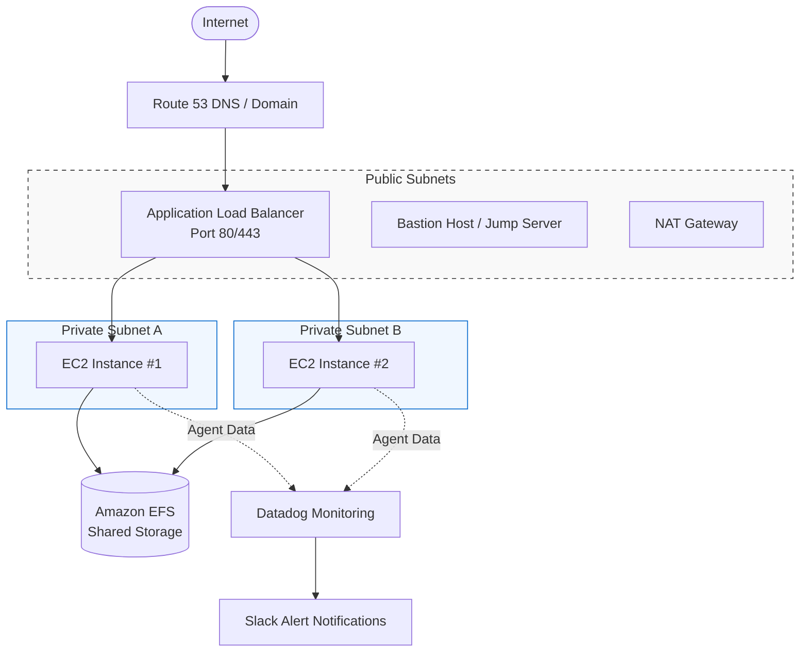
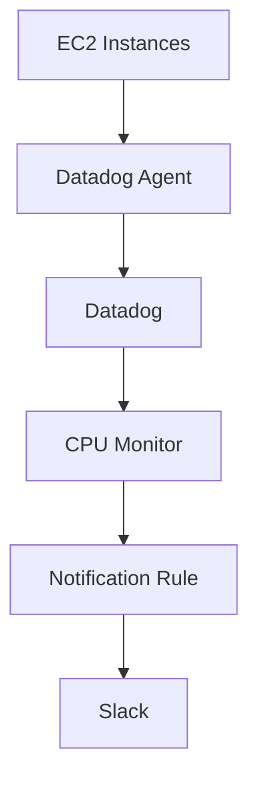

# AWS Architecture

## Overview

The application follows a highly available architecture where the Application Load Balancer distributes incoming traffic across EC2 instances running in private subnets.

The EC2 instances are managed by an Auto Scaling Group and share persistent storage through Amazon EFS.

Datadog monitors the infrastructure and sends alerts to Slack when defined thresholds are exceeded.




## VPC Architecture

```text
VPC
│
├── Availability Zone A
│   ├── Public Subnet A
│   └── Private Subnet A
│
└── Availability Zone B
    ├── Public Subnet B
    └── Private Subnet B
```

### Public Subnets
The public subnets host internet-facing resources such as:

* Application Load Balancer
* Bastion Host
* NAT Gateway

### Private Subnets
The private subnets host the application EC2 instances managed by the Auto Scaling Group.

### Storage Architecture
Amazon EFS provides shared persistent storage that can be accessed by multiple EC2 instances.

### Monitoring Architecture


