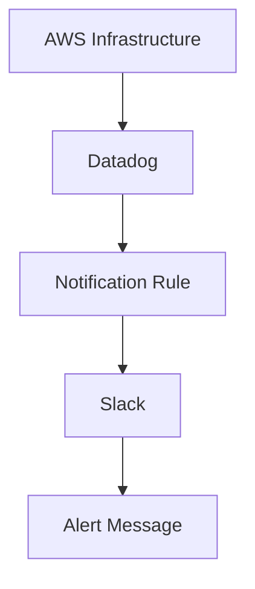

# Step 5: Slack Alert Integration
## Objective

Slack was integrated with Datadog to receive infrastructure monitoring alerts.

## 1. Create Slack Workspace

A Slack workspace was created.

## 2. Create Alert Channel

A dedicated Slack channel was created for infrastructure alerts.

## 3. Integrate Datadog with Slack

Datadog was integrated with the Slack workspace.

## 4. Invite Datadog to the Channel

The Datadog application was granted access to the designated notification channel.

## Alert Workflow

## Validation

Trigger a test notification and confirm that the alert is delivered to the Slack channel.
