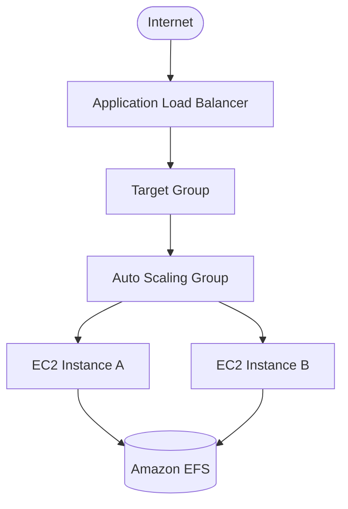

# Step 7: Web Application Deployment
## Objective

The web application infrastructure was deployed using EC2, Auto Scaling, and an Application Load Balancer.

## 7.1 Launch Template

A Launch Template was created to define the configuration used by EC2 instances launched by the Auto Scaling Group.

## Configuration
* Instance type: t2.micro
* AMI
* Private subnet configuration
* Security group
* User Data script
* Datadog Agent configuration
* Application installation/configuration

The Launch Template ensures that new instances are created consistently.

## 7.2 Auto Scaling Group

An Auto Scaling Group was created using the Launch Template.

The EC2 instances were deployed into the private subnets.

The Auto Scaling Group was configured with:

* Minimum Capacity
* Desired Capacity
* Maximum Capacity

This provides the application with the ability to automatically maintain the required number of instances.

### High Availability

Because instances are distributed across multiple Availability Zones, the application can continue operating if an individual instance or Availability Zone experiences a failure.

## 7.3 Target Group

An Application Load Balancer Target Group was created for the application instances.

The Target Group manages the EC2 instances receiving traffic from the ALB.

## 7.4 Application Load Balancer

An Application Load Balancer was deployed into the public subnets.

The ALB acts as the public entry point for the web application.

## Application Flow

## Initial Application Validation

The application was tested using the Application Load Balancer DNS name.

Successful access confirmed that:

* The ALB was reachable.
* The listener was functioning.
* The Target Group was configured correctly.
* EC2 instances were healthy.
* The application was responding correctly.
